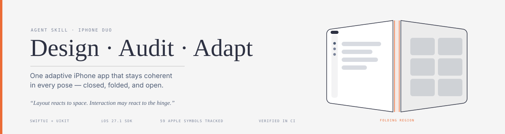
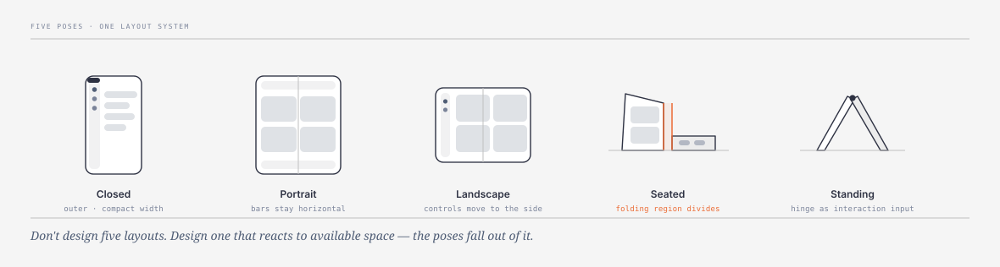
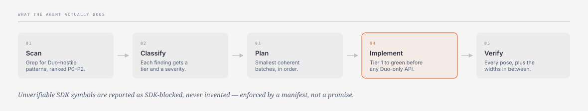
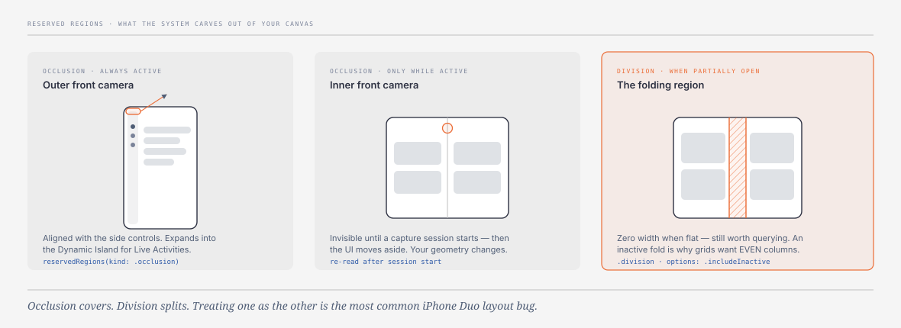
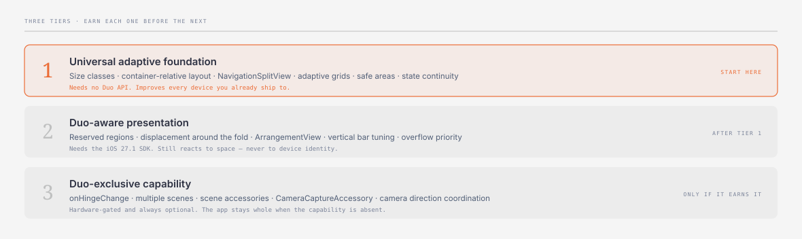

<div align="center">



<br>

**Teach your coding agent to build one adaptive iPhone app that stays coherent in every pose.**

<sub>English · [Español](docs/es/README.md) · [한국어](docs/ko/README.md)</sub>


</div>

<br>

<div align="center">

<br><sub>iPhone Duo · image © Apple Inc., served from apple.com — <a href="NOTICE.md">not redistributed here</a></sub>
</div>

<br>

## The problem

iPhone Duo has two displays, five poses, a hinge, a fold that cuts through your layout, and
two front cameras. Ask an agent to "add iPhone Duo support" and it will reach for the worst
possible answer:

```swift
if isDuo { DuoDashboard() } else { Dashboard() }   // two UIs that immediately drift apart
```

This skill stops that. It is a **rulebook**, not a library — about 3,300 tokens that always load, plus
references (~20,000 tokens total) pulled in only when the task needs them. It teaches one idea:

> **Layout reacts to available space. Physical interaction may react to the hinge.**

<br>

<div align="center">

</div>

<br>

## Quick start

```bash
git clone https://github.com/eisenjimmy/iphone-duo-skill.git

# Symlink so 'git pull' keeps the skill current (recommended)
mkdir -p ~/.claude/skills
ln -sfn "$PWD/iphone-duo-skill/skills/iphone-duo" ~/.claude/skills/iphone-duo
```

<details>
<summary><b>Other agents and install locations</b></summary>

<br>

The skill is a plain directory. Point any Agent Skills-compatible harness at it:

| Harness | Path |
|---|---|
| Claude Code (global) | `~/.claude/skills/iphone-duo` |
| Claude Code (one project) | `<your-app>/.claude/skills/iphone-duo` ← usually what you want |
| Codex | `~/.codex/skills/iphone-duo` |
| Cursor / universal | `~/.agents/skills/iphone-duo` |

Prefer the symlink above. If you copy instead, **replace rather than merge**, or renamed
files linger:

```bash
rm -rf ~/.claude/skills/iphone-duo
cp -R iphone-duo-skill/skills/iphone-duo ~/.claude/skills/
```

**Verify it loaded:** run `/skills` in Claude Code, or just ask — *"do you have the
iphone-duo skill?"*

</details>

<br>

## Use it

Three prompts cover almost everything.

```text
Use the iphone-duo skill to audit this repository. Don't change code yet.
Give me evidence by file, a tier for each issue, and the smallest plan.
```

```text
Use the iphone-duo skill to adapt this app for iPhone Duo. Preserve navigation
and view state during resizing. Finish Tier 1 before any Duo-only API.
```

```text
Review this screen for partially-open iPhone Duo use: fold interference,
reachability, and whether anything here should actually use the hinge.
```

### What a good run looks like

```text
[P1  ] tier 1  Device-identity layout branch  (3 hits)  <-- must be zero
         why  Layout must react to available space, not to which device it runs on.
         fix  Size classes, container geometry, ViewThatFits/AnyLayout.
           Sources/Dashboard.swift:44  if isDuo { DuoDashboard() } else { Dashboard() }

[P2  ] tier 2  Fixed grid column count  (1 hits)
         why  Apple advises an EVEN column count so content divides across the fold.
         fix  GridItem(.adaptive(minimum:)) sized to keep the count even.
           Sources/Gallery.swift:31    count: 3

VERDICT: material refactor needed — Device-identity layout branch (3)
```

> **If your Xcode predates 27.1** the agent marks Duo-only work `SDK-blocked` and stops
> there. That is correct behavior, not a bug — Tier 1 still improves your app on every
> device you already ship to.

<br>

<div align="center">

</div>

<br>

## What it actually knows

<div align="center">

</div>

<br>

The fold is not a line you draw around. The system carves **reserved regions** out of your
canvas — two camera *occlusions* and one folding *division* — and the difference matters:
**occlusion covers, division splits.** Treating one as the other is the most common Duo
layout bug, and it is the kind of thing an agent gets wrong silently.

The skill also carries the parts of Apple's guidance that are easy to miss:

- The inner display **in portrait keeps horizontal bars** — the one exception to side controls.
- Vertical bars are **hardware-aligned**, so they **do not flip in right-to-left languages**.
- In Split View each app puts controls on its **outer** edge.
- Grids want an **even** column count so content divides cleanly across the fold.
- Games may lock orientation but must **fill the screen** — change aspect ratio rather than letterbox.
- `builtInDuoCamera` is a **deprecated iOS 10 alias for a rear camera**. It has nothing to
  do with iPhone Duo, and it is the first thing an agent grepping for "Duo" will find.

<br>

## Three tiers, in order

<div align="center">

</div>

<br>

Most "iPhone Duo support" is Tier 1 — work that improves every device you already ship to.
Here is a real transformation, and note that it uses **no Duo API at all**:

```diff
-        if isDuo && !isFolded {
-            LazyVGrid(columns: Array(repeating: GridItem(.fixed(200)), count: 3)) { … }
-                .environmentObject(wideVM)
-        } else {
-            List { … }.environmentObject(compactVM)
-                .frame(width: UIScreen.main.bounds.width)
-        }
+        NavigationSplitView {
+            SidebarList(model: model)
+        } detail: {
+            // 220 = the card's minimum readable width. Check the resulting
            // column count is even at your target widths — Apple publishes no Duo point sizes.
+            LazyVGrid(columns: [GridItem(.adaptive(minimum: 220), spacing: 16)]) {
+                ForEach(model.items) { ItemCell(item: $0) }
+            }
+        }
```

<br>

## Why you can trust it

Skills that encode a beta SDK rot quietly, then confidently hand an agent a symbol that
never existed. This one is built so that cannot happen silently.

Every Apple symbol lives in **[`data/api-manifest.json`](skills/iphone-duo/data/api-manifest.json)**
with a status the prose is not allowed to overstate:

| Status | Meaning | Count |
|---|---|---|
| `verified` | Apple's documentation page resolves right now | **34** |
| `apple-sourced` | Verbatim from an Apple code sample; no doc page yet (iOS 27.1) | **23** |
| `conflicted` | Apple's own materials disagree on the spelling | **2** |

```bash
bash skills/iphone-duo/scripts/verify-manifest.sh
```

Re-resolves every documented symbol against developer.apple.com, fails if a reference file
names a symbol the manifest doesn't have, and **expires itself** after 45 days so a stale
research date becomes a red CI run instead of a quiet lie. It runs weekly in CI.

The audit script owns no patterns of its own either — it executes
[`data/patterns.json`](skills/iphone-duo/data/patterns.json), so there is exactly one place
to add a rule:

```bash
bash skills/iphone-duo/scripts/audit-duo.sh ~/code/MyApp
```

<br>

## Sources

Everything here traces to Apple. Nothing is invented; the two `conflicted` entries exist
because Apple's own materials disagree, and the skill says so rather than picking a winner.

<table>
<tr>
<td width="33%" align="center"><a href="https://developer.apple.com/videos/play/tech-talks/111466/"><br><sub><b>Design for iPhone Duo</b></sub></a></td>
<td width="33%" align="center"><a href="https://developer.apple.com/videos/play/tech-talks/111461/"><br><sub><b>Prepare your app</b></sub></a></td>
<td width="33%" align="center"><a href="https://developer.apple.com/videos/play/tech-talks/111462/"><br><sub><b>Raise the bar</b></sub></a></td>
</tr>
<tr>
<td align="center"><a href="https://developer.apple.com/videos/play/tech-talks/111463/"><br><sub><b>Strike a pose</b></sub></a></td>
<td align="center"><a href="https://developer.apple.com/videos/play/tech-talks/111464/"><br><sub><b>Displays and scenes</b></sub></a></td>
<td align="center"><a href="https://developer.apple.com/videos/play/tech-talks/111465/"><br><sub><b>Camera experience</b></sub></a></td>
</tr>
</table>

Plus the [Human Interface Guidelines](https://developer.apple.com/design/human-interface-guidelines/designing-for-iphone-duo)
and [Apple's iPhone Duo developer hub](https://developer.apple.com/iphone-duo/).
Full provenance: [`references/08-sources.md`](skills/iphone-duo/references/08-sources.md).

<br>

## What's inside

```text
skills/iphone-duo/
├── SKILL.md                   always loaded · ~3,300 tokens
├── data/
│   ├── api-manifest.json      ← the only authority on whether a symbol is real
│   └── patterns.json          ← the only list of anti-patterns
├── scripts/
│   ├── audit-duo.sh           executes patterns.json against a codebase
│   └── verify-manifest.sh     re-resolves every symbol; expires after 45 days
└── references/                loaded on demand · ~20,000 tokens total, 1.7k–4.1k each
    ├── 01-design-and-layout.md          Tier 1
    ├── 02-bars-and-navigation.md        Tier 1
    ├── 03-fold-arrangements.md          Tier 2
    ├── 04-hardware-scenes-hinge.md      Tier 3
    ├── 05-camera.md                     domain
    ├── 06-testing-and-review.md         process
    ├── 07-api-cookbook.md               all code lives here
    └── 08-sources.md                    provenance
```

<br>

## What this is not

A library. It ships no Swift you can link against. It changes how an agent *reasons* about
your code — the output is your codebase, improved.

<br>

## Contributing

Apple's iPhone Duo documentation is still landing. **Corrections are the most valuable
contribution here** — if a symbol got renamed or the HIG changed, open an issue and CI will
usually already agree with you.

[Contributing guide](CONTRIBUTING.md) · [Code of conduct](CODE_OF_CONDUCT.md) · [Security](SECURITY.md) · [Changelog](CHANGELOG.md)

<br>

<div align="center">
<sub>

[MIT](LICENSE) · Not affiliated with Apple Inc. · [Trademarks and image attribution](NOTICE.md)

Prior art: [FloWritesCode/fwc-swiftui-skills](https://github.com/FloWritesCode/fwc-swiftui-skills)

</sub>
</div>
